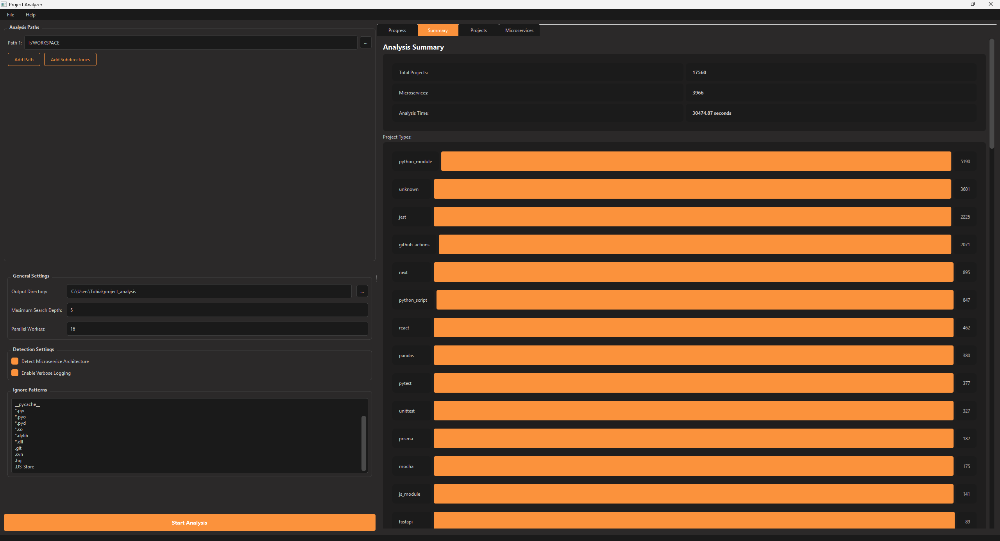

# Project Analyzer


A comprehensive tool for analyzing project structures, detecting frameworks, and identifying microservice architectures with an intuitive dark-themed GUI.



## Features

- 🔍 **Project Structure Analysis**: Recursively scans directories to analyze project structures
- 🧩 **Framework Detection**: Identifies over 80 common frameworks and libraries
- 🔄 **Microservice Architecture Detection**: Detects microservice patterns and relationships
- 📊 **Detailed Reports**: Generates comprehensive Markdown and HTML reports
- 🌐 **Multi-language Support**: Analyzes Python, JavaScript/TypeScript, Java, and other projects
- 🧪 **Test Framework Detection**: Identifies testing frameworks and patterns
- 🛠️ **DevOps Tool Recognition**: Detects Docker, Kubernetes, CI/CD configurations
- 🔄 **Parallel Processing**: Utilizes multi-threading for faster analysis
- 🖥️ **Modern GUI**: Professional PySide6-based interface with dark theme

### GUI Features

- **Dynamic Path Selection**: Add/remove multiple paths to analyze in one go
- **Customizable Settings**: Configure analysis depth, workers, and ignore patterns
- **Real-time Progress**: View analysis progress with detailed status updates
- **Interactive Charts**: Visualize project types, languages, and frameworks with animated charts
- **Detailed Results View**: Browse analyzed projects and microservices with comprehensive details
- **Report Integration**: Open generated reports directly from the UI
- **Responsive Design**: Professional dark theme UI with orange accents and smooth animations

## Installation

### Using pip

```bash
pip install Project-Analysis
```

### From Source

```bash
git clone https://github.com/rewnozom/Project-Analysis.git
cd Project-Analysis
pip install -e .
```

## Usage

### GUI Application

Launch the graphical interface:

```bash
Project-Analysis
```

Or with command-line options:

```bash
Project-Analysis --path /path/to/analyze --output /path/for/reports --debug
```

### Command Line Interface

```bash
# Run basic analysis
Project-Analysis-cli --root /path/to/analyze

# Enable microservice detection
Project-Analysis-cli --root /path/to/analyze --microservices

# Generate reports in a custom location
Project-Analysis-cli --root /path/to/analyze --output ./my-reports

# Ignore specific patterns during analysis
Project-Analysis-cli --root /path/to/analyze --ignore node_modules .venv tmp
```

## Command Line Options

| Option | Description |
|--------|-------------|
| `--root`, `-r` | Root directory to scan for projects (default: current directory) |
| `--output`, `-o` | Output directory for reports (default: ./reports) |
| `--ignore`, `-i` | Additional patterns to ignore (e.g. --ignore build dist temp) |
| `--depth`, `-d` | Maximum depth to search for projects (default: 3) |
| `--microservices`, `-m` | Enable microservice architecture detection |
| `--verbose`, `-v` | Enable verbose output |

## Architecture

Project Analyzer is organized into several modules:

```
project_analyzer/
├── __init__.py
├── main.py                # Application entry point
├── framework_patterns.py  # Framework detection patterns
├── project_analyzer.py    # Core analysis implementation
├── microservice_detector.py  # Microservice detection
└── gui/
    ├── __init__.py
    ├── main_window.py     # Main application window (ProjectAnalyzerGUI)
    ├── path_selector.py   # Path selection widget (PathSelector)
    ├── settings_panel.py  # Settings configuration (SettingsPanel)
    ├── analyzer_thread.py # Background analysis thread (AnalyzerThread)
    └── chart_widgets.py   # Custom chart visualizations
```

## Report Types

The tool generates several report types:

1. **Summary Report**: Overall statistics and findings (`summary_report.md` and `.html`)
2. **Project Reports**: Detailed analysis for each project (`{project_name}_report.md`)
3. **Microservice Report**: Microservice architecture and relationships (`microservice_report.md`)

## Framework Detection

Project Analyzer can detect over 80 different frameworks and libraries across multiple languages:

- **Web Frameworks**: Django, Flask, FastAPI, Express, React, Angular, Vue, etc.
- **Data Science**: TensorFlow, PyTorch, Scikit-learn, Pandas, etc.
- **Testing**: Jest, Mocha, Pytest, JUnit, etc.
- **DevOps**: Docker, Kubernetes, Terraform, etc.
- **Databases**: SQLAlchemy, Mongoose, Sequelize, etc.
- **And many more!**

## Microservice Detection

The tool can identify microservice architectures by detecting:

- Service boundaries
- Inter-service communication patterns
- API endpoints and gateways
- Message brokers and event-driven designs
- Containerization and orchestration
- And visualize service relationships with interactive diagrams
